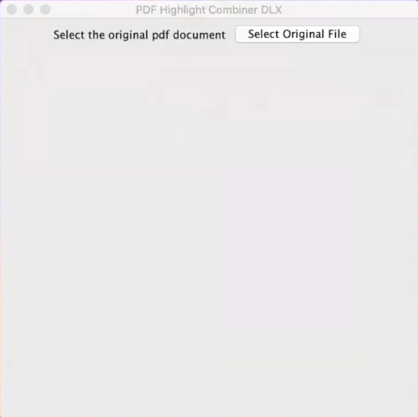
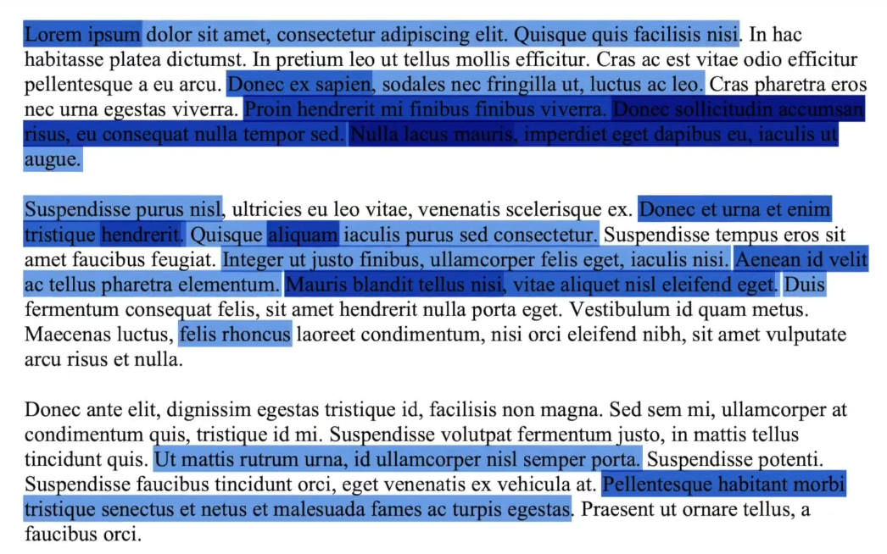

# PDF Highlight Combiner DLX
This project is a submission to Dubhacks 2020.   
   
Our application allows teachers to send a pdf file out to the class as reading assignment. 
The students will then highlight parts of the reading that they find interesting, confusing, or in any way captivating.
Our software will then analyzes through all PDF documents provided by the students and combine their highlights into a heatmap where
the text that was most annotated will be highlighted a darker shade and those interacted with less will be lighter.
takes note of what they highlighted and where that highlight was made. 
  
